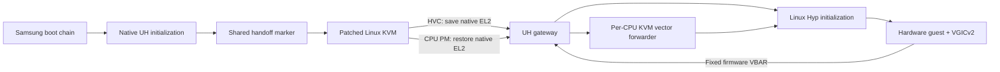

# KVM on Samsung Galaxy A51

[](https://github.com/SeniorStackOverflow/a51-kvm/actions/workflows/offline.yml)
[](LICENSE)


**Hardware KVM on Exynos 9611, verified on a real A51.** A small Samsung UH gateway hands EL2 to Linux KVM, preserves native firmware exception routing, and restores the original EL2 context across CPU power transitions.

[Русский](README.ru.md) · [Build](docs/build.md) · [Architecture](docs/architecture.md) · [Install & recovery](docs/install.md) · [Validation](docs/validation.md) · [Releases](https://github.com/SeniorStackOverflow/a51-kvm/releases)

## What works

Tested on **SM-A515F, Android 11, A515FXXU5EUJ4**, unlocked bootloader, kernel **4.14.113-22755563**. The kernel names this SoC `CONFIG_SOC_EXYNOS9610`; the phone uses Exynos 9611.

| Check | Hardware result |
| --- | --- |
| Android boot + root | Passed, including a normal reboot |
| `/dev/kvm` + API | Root-only device, KVM API 12 |
| Guest execution | `KVM_RUN`: guest instructions write **42** through MMIO |
| CPU coverage | All **8 CPUs**, 12 VM create/destroy cycles |
| Idle and migration | Same vCPU survives 10 runs across both clusters; all CPUs enter deep idle |
| Guest interrupts | VGICv2 delivers virtual timer **PPI27**, on CPU0 and CPU4 |
| After reboot | Guest execution and both timer clusters passed again |
| Recovery | Original signed UH restored through Download Mode; partition hash verified |

The [sanitized hardware evidence](evidence/hardware-summary.json) records the measurements. This is a research prototype for **one audited firmware layout**. Full Linux guests, SMP guests, long-running workloads, suspend-to-RAM and other A51 variants remain untested. CI exercises a synthetic EL2 harness, separate from the handset results.

## Why a UH gateway?

Samsung UH already owns EL2 when Android starts. Turning on `CONFIG_KVM` does not give Linux control of that exception level. This project installs a firmware-specific HVC gateway in audited UH padding, then enters the kernel's real Hyp initialization path. It also frees the unused architectural timer IRQ from Samsung's counter-only driver so KVM can register its guest timer.



## Start with the offline test

On Ubuntu or WSL Ubuntu:

```sh
sudo apt-get update
sudo apt-get install -y make python3 git binutils-aarch64-linux-gnu gcc-aarch64-linux-gnu qemu-system-arm
git clone https://github.com/SeniorStackOverflow/a51-kvm.git
cd a51-kvm
make check
```

This builds our gateway, publisher and static arm64 probes, then checks four takeover/restore cycles under QEMU with native MMU, stage-2 translation and WXN enabled. It does not need a phone or Samsung firmware.

## Reproduce the phone build

Follow [the build guide](docs/build.md) for the pinned kernel source, exact tested configuration and legacy Android toolchains. Supply your own original UH and boot partition backups; the tools verify the UH hash and refuse other firmware.

```sh
python3 tools/prepare_kernel.py build/kernel-src
# Build the kernel using scripts/build-kernel.sh and the documented toolchains.
python3 tools/uh_image.py rollback private/original-uh.img --out private/restore-original-uh.tar
python3 tools/uh_image.py pack private/original-uh.img --out private/uh-kvm.img
python3 tools/boot_image.py private/original-boot.img build/kernel-out/arch/arm64/boot/Image \
  --system-map build/kernel-out/System.map --out private/boot-kvm.img
```

Read [installation and recovery](docs/install.md) **before writing either partition**. The kernel and UH form a pair. A full 2 MiB UH dump is useful for recovery writes, but its trailing zero padding must be removed for a signed Download Mode restore. That distinction caused a real `SECURE CHECK FAIL (UH)` during this work.

## Contents

| Directory | Purpose |
| --- | --- |
| `kernel/` | Compact kernel patch, full tested `.config`, pinned upstream commit |
| `uh/` | AArch64 gateway, successful-init publisher, fixed-address linker script |
| `probes/` | Real KVM guest and VGICv2 virtual timer probes |
| `tests/` | Synthetic EL2 handoff harness and firmware rejection checks |
| `tools/` | Guarded image preparation, source setup and device validation |
| `docs/` | Build recipe, memory map, HVC ABI, recovery and failure analysis |
| `evidence/` | Curated results from the handset; no serials or full Android logs |

Source and generated EL2 gateway fragments are published; native guest probes build locally with `make probes`. Samsung UH/boot/recovery dumps and personal ramdisks stay local. Build timestamps and your ramdisk affect boot hashes; reference hashes identify this experiment, rather than a universal boot image.

## Credits and license

Kernel work builds on Linux and Samsung's A515FXXU5EUJ4 source, preserved by [UtsavBalar1231](https://github.com/UtsavBalar1231/kernel_samsung_universal9611). [sleirsgoevy's earlier Exynos KVM work](https://github.com/sleirsgoevy/exynos-kvm-patch) provided useful background; this A51 gateway uses a different bootstrap for native UH ownership of EL2.

Published code is **GPL-2.0-only**; existing kernel notices remain in the patch. See [LICENSE](LICENSE) and [third-party provenance](docs/provenance.md). Samsung firmware is user-supplied and is not covered by this project's license.
